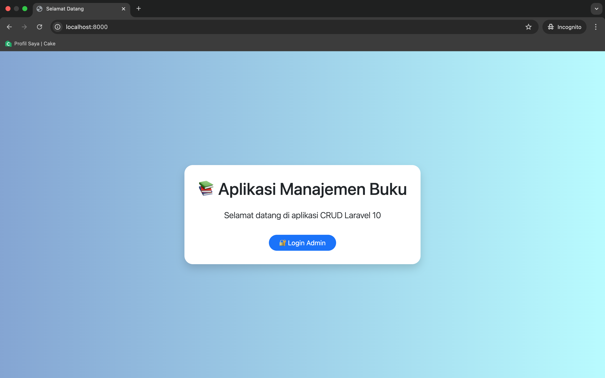
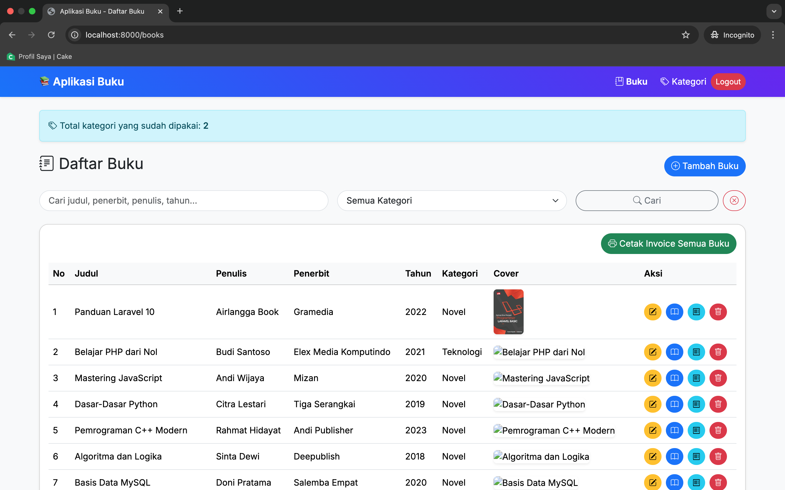
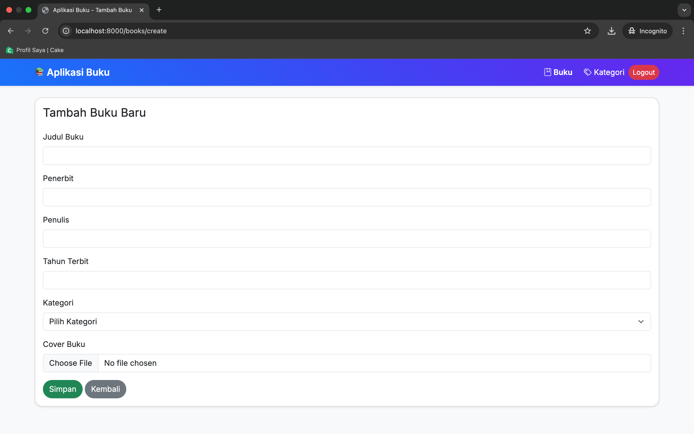
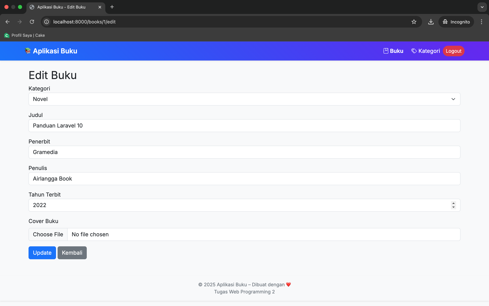
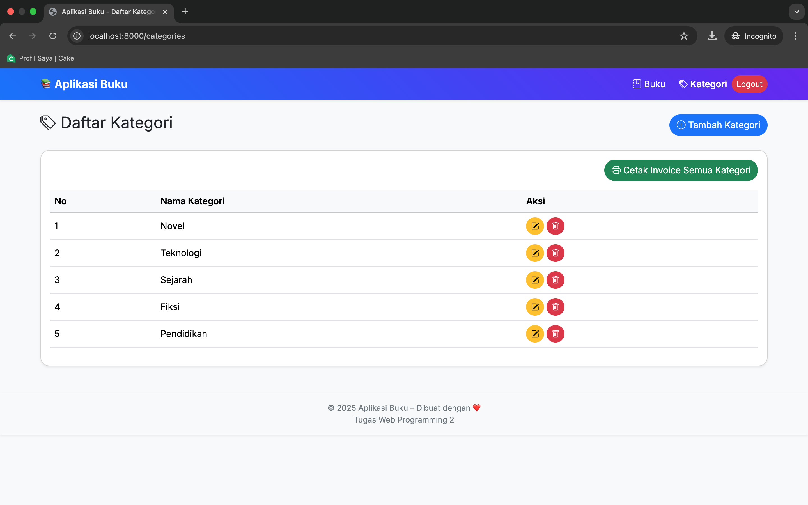
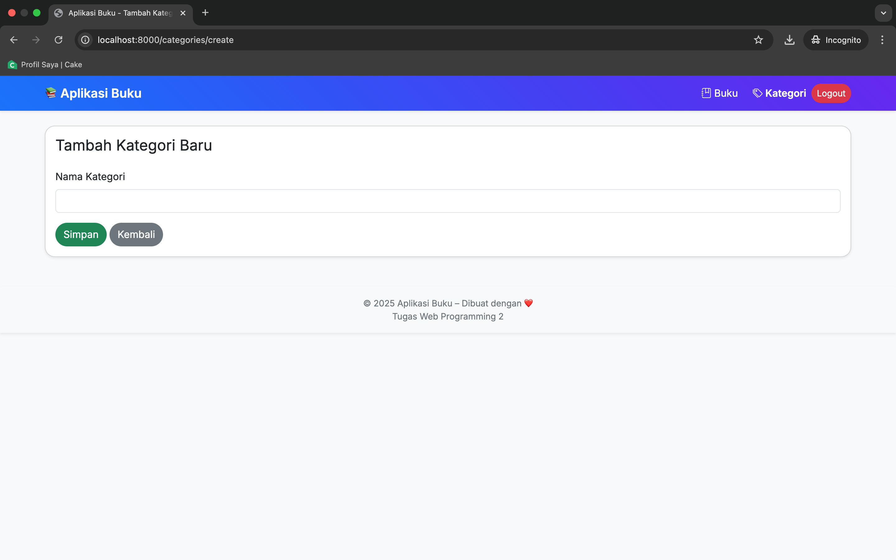
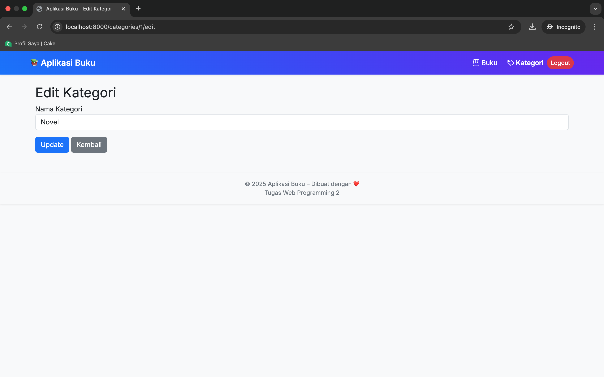

# 📚 Laravel Book Management App

[](https://laravel.com/)
[](LICENSE)
[](https://www.php.net/)

A simple **Laravel 10** application to manage books and categories with search, filter, cover upload, and invoice reports.



---

## 🚀 Features

✅ **CRUD Buku**  
✅ **CRUD Kategori**  
✅ **Cari Buku** by judul, penulis, penerbit, tahun
✅ **Filter by category**  
✅ **Upload book covers** (JPG, PNG, max 2MB)  
✅ **Invoice report**:

-   Total books
-   Total categories
-   Books count per category  
    ✅ **Individual book invoice view**

✅ **Bootstrap 5 UI** with responsive design

---

## ⚙️ Requirements

-   PHP >= 8.1
-   Laravel 10
-   MySQL / MariaDB

---

## 💻 Installation

1. Clone the repository

```bash
git clone https://github.com/zidan-herlangga/manajemen-buku.git
cd manajemen-buku
```

2. Install dependencies

```bash
composer install
```

3. Install library PDF

```bash
composer require barryvdh/laravel-dompdf
```

4. Setup Environment

```bash
cp .env.example .env
php artisan key:generate
```

Edit `.env` and configure your database:

```bash
DB_DATABASE=manajemen_buku
DB_USERNAME=root
DB_PASSWORD=
```

5. Run migration & link storage

```bash
php artisan migrate
php artisan storage:link
```

6. Add seeder

```bash
php artisan migrate:fresh --seed
```

7. Run server

```bash
php artisan serve
```

Run: http://localhost:8000

---

## Review

### 📌 Daftar Buku


### 📌 Daftar Buku



### 📌 Tambah Buku



### 📌 Edit Buku



### 📌 Daftar Kategori



### 📌 Tambah Kategori



### 📌 Edit Kategori



---

## Lisensi

Projek ini open-source dibawah [MIT License](LICENSE).

---

## Credits

-   Laravel
-   Bootstrap
-   Icons by Bootstrap Icons
